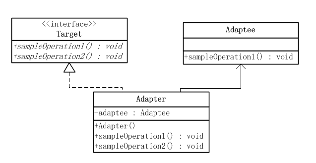

# 结构型模式
共分为7种：
* 适配器模式
* 装饰器模式
* 代理模式
* 外观模式
* 桥接模式
* 组合模式
* 享元模式

## 1、适配器模式
适配器模式（Adapter），将一个类的接口转换成客户希望的另外一个接口。Adapter模式使得原本由于接口不兼容而不能一起工作的那些类可以一起工作。

### 1.1、适配器的用途
用电器做例子，笔记本电脑的插头一般都是三相的，即除了阳极、阴极外，还有一个地极。而有些地方的电源插座却只有两极，没有地极。电源插座与笔记本电脑的电源插头不匹配使得笔记本电脑无法使用。这时候一个三相到两相的转换器（适配器）就能解决此问题，而这正像是本模式所做的事情。

### 1.2、适配器模式的结构
适配器模式有类的适配器模式和对象的适配器模式两种不同的形式。

**类适配器模式**

类的适配器模式把适配的类的API转换成为目标类的API。

**对象适配器模式**

与类的适配器模式一样，对象的适配器模式把被适配的类的API转换成为目标类的API，与类的适配器模式不同的是，对象的适配器模式不是使用继承关系连接到Adaptee类，而是使用委派关系连接到Adaptee类。

## 2、装饰器模式

## 3、代理模式
### 3.1、静态代理
1. 可以做到在不修改目标对象的功能前提下,对目标功能扩展。
2. 缺点是代理对象需要与目标对象实现一样的接口，所以会有很多代理类，类太多。同时，一旦接口增加方法，目标对象与代理对象都要维护。

### 3.2、动态代理
[细说JDK动态代理的实现原理](https://blog.csdn.net/mhmyqn/article/details/48474815)

实现步骤：
1. 查询缓存中是否已经有对应的代理类，如果没有走第2步。
2. jdk默认生成com.sun.proxy.$Proxy0的代理类，继承自Proxy，实现用户定义的接口。这都是写死的，所以我们不可以使用jdk动态代理代理没有接口的类。
3. 使用用户定义的InvocationHandler实现类去反射实例化代理类。
4. 返回实例化好的代理类。

### 3.3、cglib
[ Java动态代理机制详解（JDK 和CGLIB，Javassist，ASM）](https://blog.csdn.net/luanlouis/article/details/24589193)